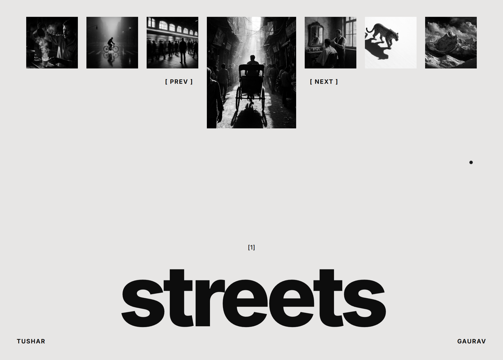

# tushar.photo

The personal photography portfolio of **Tushar Gaurav** — a black-and-white journal of streets, wildlife, landscapes, and portraits shot across India.



## About

A minimal, motion-driven photography site built around four bodies of work. Each category is a self-contained gallery with its own intro, full-frame and split layouts, captions, and shot metadata (camera, lens, and settings). The whole experience leans into a stark monochrome aesthetic with an animated intro, custom cursor, and page transitions.

### Collections

- **streets** — candid moments, light cutting through alleys, the city breathing.
- **wildlife** — patient frames earned by sitting still: leopards, elephants, eagles, wild horses.
- **landscapes** — Himalayan ridges, desert dunes, coastlines, and long-exposure waterfalls.
- **portraits** — strangers and craftspeople, each photo starting with a conversation.

## Tech Stack

- [Next.js 16](https://nextjs.org) (App Router)
- [React 19](https://react.dev)
- [Tailwind CSS 4](https://tailwindcss.com)
- [Framer Motion](https://www.framer.com/motion/) for intro, transitions, and gallery animations
- [shadcn](https://ui.shadcn.com) / [Base UI](https://base-ui.com) components
- [Vercel Analytics](https://vercel.com/analytics)

## Project Structure

```
app/
  page.tsx            # Home hero + intro loader
  [category]/page.tsx # Dynamic gallery per collection
  about/page.tsx      # About / bio
  layout.tsx          # Fonts, cursor, page transitions
components/            # Hero, gallery, lightbox, cursor, transitions
lib/photos.ts         # Collections + photo metadata (single source of truth)
public/photos/        # Image assets
docs/                 # Screenshots and project docs
```

All collections and per-photo metadata live in `lib/photos.ts` — add or edit a category there and the routes, navigation, and galleries update automatically.

## Getting Started

Install dependencies and run the development server:

```bash
npm install
npm run dev
```

Open [http://localhost:3000](http://localhost:3000) to view the site.

## Scripts

| Command | Description |
| --- | --- |
| `npm run dev` | Start the development server |
| `npm run build` | Build for production |
| `npm run start` | Run the production build |
| `npm run lint` | Lint the codebase |
